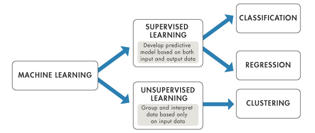

# NTUOSS-DataOdyssey
**By [Han Simeng](https://github.com/ShirleyHan6) from [NTU Open Source Society](https://www.ntuoss.com)**

<!-- blank line -->

Artwork by Brendan Hyde

---
<!-- blank line -->

| Workshop Details |                                                                                       |
| :---:            | ---                                                                                   |
| When             | Friday, 9 Sep 2018. 6:30 PM - 8:30 PM                                                |
| Where            | LT1, NTU North Spine Plaza                                                            |
| Who              | NTU Open Source Society                                                               |
| Questions        | We will be hosting a Pigeon Hole Live for collecting questions regarding the workshop |
### Errors

For errors, typos or suggestions, please do not hesitate to [post an issue](https://github.com/wilsonteng97/NTUOSS-PandasBasics/issues/new)! Pull requests are very welcome, thank you!

**_Disclaimer: This workshop is for educational purposes only. No prototype or outcome of any type is intended for commercial use._**

---
### Introduction

<strong>Machine Learning</strong> is an interdisciplinary subject where computer science and statistics intersect.  
In the workshop today, we will focus on the practical aspect of machine learning, i.e.,coding. 
In most cases, we give our algorithm an input and it gives us an output.  
However, for a machine learning algorithm, we first feed a lot of data to the algorithm to let the algorithm determine itself how it should react to the data. This is the process of determining the parameters of the machine learning <strong>model</strong>. 

In <strong>supervised</strong> machine learning, we feed the input and <strong>label</strong>, into the model and it will learn how to predict the output when we feed new inputs. Think about supervised learning as learning with a teacher who tells you the right answers. 

In <strong>unsupervised</strong> machine learning, we only feed the input and the model will learn to predict the output solely based on the input. Think about unsupervised learning as learning without a teacher. Not all real-world data have a label, thus the necessity of unsupervised learning.

The second workshop will introduce two machine learning algorithms in order to demonstrate how the field can be used in real-world scenarios.  
This includes logistic regression, a supervised method to solve classification problems, as well as k-means clustering, an unsupervised method to group together clusters of data by certain criteria. 
 
We will use [scikit-learn](https://scikit-learn.org/stable/index.html), a python package built for implement machine learning algorithms.  
[Logistic Regression with scikit-learn](https://scikit-learn.org/stable/modules/generated/sklearn.linear_model.LogisticRegression.html) 
[K-Means with scikit-learn](https://scikit-learn.org/stable/modules/generated/sklearn.cluster.KMeans.html) 

### Google Colabtory
See [NTUOSS-PandasBasics](https://github.com/wilsonteng97/NTUOSS-PandasBasics) for a comprehensive introduction on how to use Google Colabtory for data science projects and let's walk through it.  
[Notebook](https://colab.research.google.com/drive/114hqdZq7EtMqYCNuMhwcb6xyLOZ6S1Dt)  
Go to [this link](https://drive.google.com/drive/folders/1udniYJu3xmxuNFud8FDn0yyESkXOAzCF?usp=sharing) to download the data to be used in this workshop and upload it to Google Colabtory.  

### Odyssey Begins

1. [Supervised Odyssey: `Supervised Classification`](#supervised)
    * [Packing up: Environment Setup](#prep)
    * [Data Exploration](#explore1)
    * [Data Classification: `Logistic Regression`](#logreg)
      + [Intuition](#intuition1)
      + [Coding with sklearn](#coding1)
    * [Result Visualization](#viz1)
2. [Unsupervised Odyssey: `Unsupervised Classification`](#unsupervised)
    * [Data Exploration](#explore1)
    * [Image Compression: `K-Means`](#k_means)
      + [Intuition](#intuition2)
      + [Coding with sklearn](#coding2)
    * [Result Visualization](#viz2)
3. [End of journey](#end)
---
##  Supervised Odyssey: Supervised Classification 
###  Packing up: Environment Setup 

> Import the module for linear regression algorithm from sklearn and plotting packages
<!-- blank line -->

<!-- blank line -->
---
## Data Exploration 
> Use numpy to load the file as a data object

<!-- blank line -->
> Inspect more details

<!-- blank line -->
> Plot all data

<!-- blank line -->

<!-- blank line -->
---
## Data Classification: Logistic Regression 
Logistic Regression is used when the dependent variable(target) is categorical, i.e., we want to find <strong>class</strong> which each of the variables belongs to. 
For example, to classify spam emails, we find whether an email belongs to the spam class or the normal class. 
### Algorithm Intuition ([online demo](https://www.desmos.com/calculator/naf1qogfjn))

<!-- blank line -->
---
### Coding with sklearn 
> **Sigmoid** function adds non-linearity into the model  
**z** is the input to the sigmoid function, which is the dot product of input **X** and the weight **w** 

<!-- blank line -->
Logistic regression predictive function

<!-- blank line -->
To conduct logistic regression with scikit-learn, we first create a **LogisticRegression** object 
Then we **fit** the model to the **data** 
The **intercept** and **coef** are the model parameters(weights)

<!-- blank line -->
---
## Result Visualization 
> After obtaining the parameters, lets visualize the result by plotting the decision boundary.  
Students whose score points are above the decision boundary will be admitted while the students below the decision boundary will be rejected

<!-- blank line -->
> Now let's use our trained logistic regression model to predict if a student will be accepted or rejected.

---
<!-- blank line -->
## Unsupervided Odyssey: Unsupervised Classification 
<!-- blank line -->
> Import the image reading module from matplotlib and the K-Means module from sklearn

<!-- blank line -->
---
## Data Exploration 
Read the image

A 2D image is comprised of two dimensional RGB values.  
700 is the row number. 
1000 is the column number. 
3 is the R, G, B value respectively.  
<!-- blank line -->
---
## Image Compression: K-Means 
### Algorithm Intuition ([Online Demo](http://alekseynp.com/viz/k-means.html))

K-means is one of the most popular unsupervised clustering algorithms.  
"K" in K-means refers to k number of clusters.  
"Means" refers to finding the means, or centroids of the clusters.  
<!-- blank line -->
---
### Coding with sklearn 
> Reshape the image to be 2-dimension 
>To run the KMeans algorithm, we first create a scikit-learn KMeans object with the number of clusters assigned to 20, which is the number of colors we want for the compressed image.
>Fit the model to the data, then use the centroids to compress the image

<!-- blank line -->
---
## Data Visualization 
> Reshape X_recovered to have the same dimension as the original image 
> Now we can plot the original and the compressed image side by side. 

<!-- blank line -->
---
## End of Odyssey!
## End of Journey 
Congratualations on completing the Machine Learing Odyssey! 
In this workshop we have learned how to use machine learning algorithms to solve some simple real-world problems.  
In the next, which is also the last workshop of the NTUOSS Data Science workshop series, we will teach you **deep learning**, which is a subfield of machine learning and is even more interesting! 

An approchable book if you want to learn more: [A Course in Machine Learning](http://ciml.info/)
<!-- blank line -->

